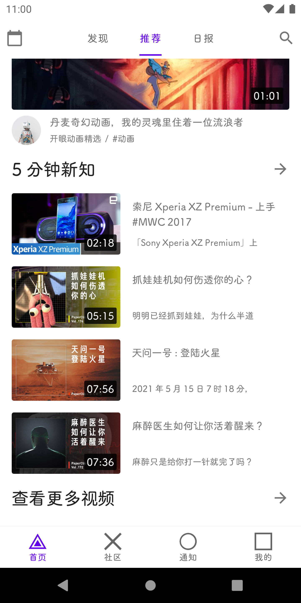

# 仿写「Eyepetizer 」

「开眼 Eyepetizer 」是一款汇聚全球优质短视频 APP，每日精挑细选优质高清短视频，为你奉上惊艳的视觉盛宴，让你大开眼界。应用内汇聚了旅行运动、创意广告、生活集锦、科普干货等新鲜有趣的视频，给你视觉上的惊艳和了解世界的新方式。

# 核心技术栈
## Kotlin语言
Kotlin 是一种在 Java 虚拟机上运行的静态类型编程语言，被称之为 Android 世界的Swift，由 JetBrains 设计开发并开源。
Kotlin 可以编译成Java字节码，也可以编译成 JavaScript，方便在没有 JVM 的设备上运行。
在Google I/O 2017中，Google 宣布 Kotlin 成为 Android 官方开发语言。
Kotlin语言100%兼容Java,并且具有数据类、空安全、延迟加载、属性代理、拓展方法、函数表达式、高级函数等高级特性，极大的简化代码量，不需要为空指针烦恼、不需要编写复杂的JavaBean,能够更专注业务。

## AAC架构
>Android Architecture Components,简称 AAC，一个处理UI的生命周期与数据的持久化的架构，它基于管理UI组件生命周期和处理数据持久性的类，可以帮助您设计健壮、可测试和可维护的应用程序。

Model-View-ViewModel，View 指绿色的 Activity/Fragment，主要负责界面显示，不负责任何业务逻辑和数据处理。Model 指的是 Repository 包含的部分，主要负责数据获取，来组本地数据库或者远程服务器。ViewModel 指的是图中蓝色部分，主要负责业务逻辑和数据处理，本身不持有 View 层引用，通过 LiveData 向 View 层发送数据。Repository 统一了数据入口，不管来自数据库，还是服务器，统一打包给 ViewModel。
### 核心组件
- Lifecycles：它持有关于组件（如 Activity 或 Fragment）生命周期状态的信息，并且允许其他对象观察此状态
- ViewModel：以注重生命周期的方式管理界面相关的数据,为Activity 、Fragment存储数据，直到完全销毁；
- LiveData：不用手动控制生命周期，不用担心内存泄露，数据变化时会收到通知，与ViewModel的组合使用可以说是双剑合璧，而Lifecycles贯穿其中；
- ViewBinding：将布局组件与源数据绑定，使源数据变化的同时布局组件及时同步更新，与ViewModel、LiveData、Lifecycles搭配使用，能够碰撞出极致的MVVM火花
- Room：流畅地访问 SQLite 数据库；

### 优势

- 通过它可以非常优雅的让数据与界面交互
- 并做一些持久化的东西
- 高度解耦
- 自动管理生命周期
- 而且不用担心内存泄漏的问题

### Retrofit + Okhttp + Coroutines(协程)打造强大的网络请求
- Retrofit：Square出品的网络请求库，极大的减少了http请求的代码和步骤。

- Okhttp： Square出品的网络请求库，适用于Android和Java的类型安全的HTTP客户端。

- Coroutines(协程)：kotlin1.3版本发布，Coroutines稳定版也正式发布，Coroutines真是非常神奇，让你可以使用同步的方式写异步请求代码，增强代码的可读性、不在为回调而烦恼、优雅的进行线程切换操作，Coroutines的“黑魔法“特性会让你眼前一亮。

### Coroutines(协程)
> 协程通过将复杂性放入库来简化异步编程。程序的逻辑可以在协程中顺序地表达，而底层库会为我们解决其异步性。该库可以将用户代码的相关部分包装为回调、订阅相关事件、在不同线程（甚至不同机器）上调度执行，而代码则保持如同顺序执行一样简单。

协程相对于线程的优点： 
在Android中新建一个线程，大约需要消耗1M的内存，如果使用线程池，线程间数据的同步是一个非长复杂的事情，所以就有了协程：

- 可以看作是轻量级线程，创建一个协程的成本很低    
  
- 可以轻松的挂起和恢复操作  
  
- 支持阻塞线程的协程和不阻塞线程的协程    
  
- 可以更好的实现异步和并发  

## Coil
Coil是Android平台上又一个开源的图片加载库，采用Kotlin为开发语言，将协程、OKHttp、OKIO和AndroidX作为一等公民，以期打造成一个更加轻快、现代化的图片加载库
Coil目前支持其它图片加载库所包含的所有功能，除此之外它还有一个独特的特性：动态采样（Dynamic image sampling），简而言之就是可以在内存中只缓存了一个低质量的图片而此时需要显示同一个高质量的图片时，Coil可以先把低质量的图片作为 ImageView 的 placeHolder 并同时去磁盘缓存中读取对应的高质量图片最后以“渐进式”的方式替换并最终显示到视图中，例如最常见的从图片列表到预览大图的场景。

# 应用截图

